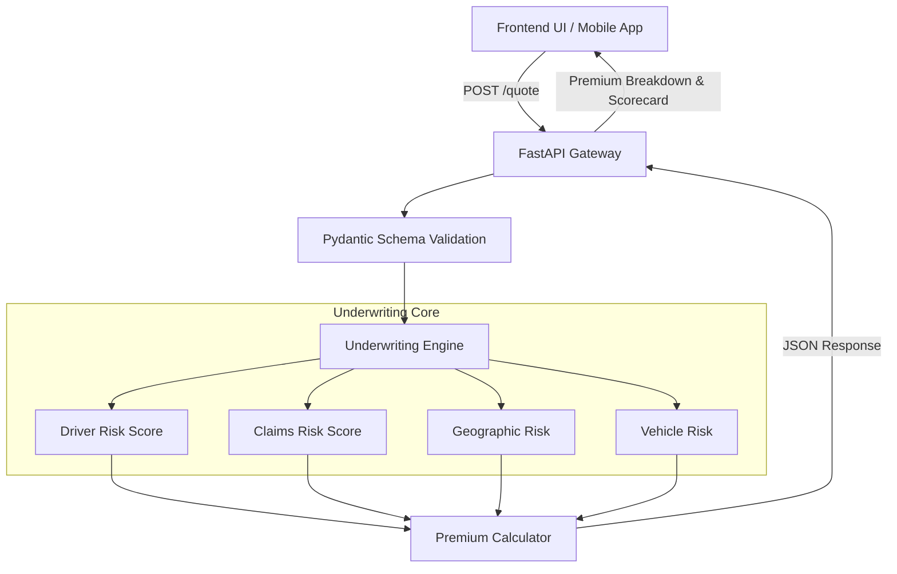

# Zensung Underwriting Risk Engine

An enterprise-grade, modular InsurTech underwriting engine designed to dynamically calculate motor insurance risk profiles and compute standardized premiums based on real-world actuarial logic (PIAM proxy tariffs, NCD step-backs, and GLM interaction penalties).

## 🏗️ Architecture Overview

The system is built as a **Modular Monorepo**, strictly separating the presentation layer from the core actuarial business logic.

- **Backend (`/backend`)**: A highly decoupled REST API built with FastAPI. It handles complex mathematical operations, data validation (via Pydantic), and acts as a stateless calculation "black-box".
- **Frontend (`/frontend`)**: A pure vanilla JavaScript, HTML, and CSS single-page application (SPA). It acts as a lightweight presentation layer to visualize the JSON outputs from the engine.
- **Documentation (`/docs`)**: Contains the system design philosophy and detailed actuarial pricing rules.

### System Flow


## 🚀 Getting Started

### Prerequisites
- Python 3.9+
- A modern web browser

### 1. Start the Backend API
Navigate to the `backend` directory, activate your virtual environment (if you are using one), and launch the FastAPI server using Uvicorn. We run on Port 8015 to prevent any ghost process conflicts.

```bash
cd backend
# Windows
..\venv\Scripts\uvicorn app.main:app --port 8015 --reload
# Mac/Linux
../venv/bin/uvicorn app.main:app --port 8015 --reload
```
*The API will now be listening at `http://localhost:8015/quote`.*

### 2. Start the Frontend Application
Open a new terminal window at the **root** of the repository (not inside `/frontend`), and spin up a lightweight HTTP server to serve the assets.

```bash
python -m http.server 8080
```
*Navigate your web browser to `http://localhost:8080/frontend/index.html` to access the dashboard.*

## 🧠 Core Underwriting Logic

The pricing engine simulates enterprise insurance logic by calculating a **Composite Risk Score** out of 100 points, broken into functional domains:

1. **Driver Risk (30 pts):** Evaluates age, traffic violations, and telematics behavior. High-risk ages (under 25 or over 70) and frequent violators trigger steep penalties.
2. **Claims Risk (25 pts):** Tracks claim frequency and severity. Crucially, the engine mathematically enforces the **NCD Step-Back Rule**. If a prior claim exists and the driver has no NCD Protector, the engine overrides the requested NCD to `0%`.
3. **Geographic Risk (20 pts):** Uses territorial zoning. High-density urban areas (Klang Valley, Penang, Johor) carry heavy weight due to traffic density and theft frequencies, whereas rural East Malaysia carries a baseline score of `0`.
4. **Vehicle Risk (15 pts):** Categorizes assets (e.g., Luxury vs. Commercial Pickup) and applies valuation penalties.
5. **Usage Risk (10 pts):** Penalizes high annual mileage and commercial/e-hailing usage.

### Enterprise Edge Cases Handled:
- **GLM Concentration Penalty**: If a profile scores dangerously high (>70%) across multiple domains simultaneously, a synergistic risk penalty is applied.
- **Minimum Premium Floors**: The engine enforces a strict base premium floor; if aggressive discounts drop the rate below the sustainable threshold, the engine automatically floors it.
- **Mandatory Add-ons**: If a user is located in a High-Risk Flood Zone, the engine automatically injects Flood Endorsement pricing and flags the metadata to notify the user dynamically.
